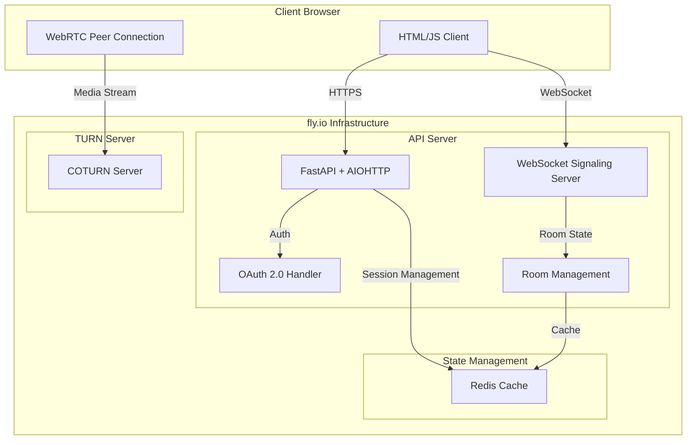

# Rhystic - P2P Video Streaming for Tabletop Gaming

## Overview
Rhystic is a WebRTC-based video streaming application designed for tabletop gaming. It enables players to stream their game tables/boards and connect with other players remotely.

## Quick Start (Docker)

### Prerequisites
- [Docker](https://docs.docker.com/get-docker/)
- [Docker Compose](https://docs.docker.com/compose/install/)

### Development Setup

1. Clone the repository:
```bash
git clone https://github.com/your-username/rhystic.git
cd rhystic
```

2. Start the development environment:
```bash
docker compose up --build
```

This will start:
- API server: http://localhost:8080
- TURN server for WebRTC
- Hot-reloading for development

### Development Notes

- Code changes will automatically reload
- Logs can be viewed with:
  ```bash
  # All services via docker
  docker compose logs -f

  # Individual services via docker
  docker compose logs -f api
  docker compose logs -f coturn

  # All services via journald
  journalctl -f -t rhystic-api -t rhystic-turn

  # Individual services
  journalctl -f -t rhystic-api    # API logs only
  journalctl -f -t rhystic-turn   # TURN server logs only

  # Filter by severity
  journalctl -f -t rhystic-api -p err  # Errors only
  ```

- To rebuild after dependency changes:
  ```bash
  docker compose build --no-cache
  ```

### Testing

Run tests inside the container:
```bash
docker compose exec api pytest
```

### Debugging

1. View real-time logs:
  ```bash
  docker compose logs -f
  ```

2. Access a running container:
  ```bash
  docker compose exec api bash
  ```

3. Check TURN server status:
  ```bash
  docker compose exec coturn turnutils_status
  ```

## Features
- P2P video streaming using WebRTC
- Room-based connections (up to 8 peers per room)
- STUN/TURN server fallback for NAT traversal
- Real-time signaling server
- Web-based client interface

## Requirements
- Python 3.8+
- aiohttp
- coturn (TURN server)
- Modern web browser with WebRTC support

## Installation

1. Install Python dependencies:
```bash
pip install -r requirements.txt
```

2. Install and configure coturn:
```bash
sudo apt-get install coturn
sudo cp config/turn-setup.conf /etc/turnserver.conf
sudo nano /etc/turnserver.conf
```

3. Configure server settings:
```bash
cp config.example.py config.py
# Edit config.py with your settings:
# - Set DEBUG based on environment
# - Configure TURN server credentials
# - Update security settings
# - Adjust rate limits if needed
```

## Local Development

### Installing TURN Server (coturn)

#### Ubuntu/Debian
```bash
# Install coturn
sudo apt update
sudo apt install coturn

# Enable the service
sudo systemctl enable coturn
```

#### MacOS
```bash
# Using Homebrew
brew install coturn
```

#### Windows
```bash
# Using Chocolatey
choco install coturn
```

#### Basic Configuration
Create or edit `/etc/turnserver.conf` (Linux/MacOS) or `C:\turnserver.conf` (Windows):
```conf
# Basic development configuration
listening-port=3478
tls-listening-port=5349
listening-ip=0.0.0.0
external-ip=127.0.0.1
realm=localhost
server-name=localhost

# Authentication
user-quota=12
total-quota=1200
authentication-method=secret-based
static-auth-secret=development_secret_key

# Development SSL (optional)
# cert=/etc/ssl/certs/localhost.crt
# pkey=/etc/ssl/private/localhost.key

# Port range
min-port=49152
max-port=65535

# Logging
verbose
```

#### Starting the Service
```bash
# Linux/MacOS
sudo systemctl start coturn  # As a service
# or
turnserver -c /etc/turnserver.conf  # Direct

# Windows
net start coturn  # As a service
# or
turnserver.exe -c C:\turnserver.conf  # Direct
```

### Development Options

You can develop either directly on your machine or using Docker. Docker provides a consistent environment and simplifies TURN server setup.

#### Option 1: Docker Development

1. Install Docker and Docker Compose:
```bash
# Ubuntu/Debian
sudo apt-get install docker.io docker-compose

# MacOS
brew install docker docker-compose
```

2. Start the development environment:
```bash
# Build and start containers
docker-compose up --build

# Or run in detached mode
docker-compose up -d
```

The Docker setup provides:
- Hot-reloading Python server
- Preconfigured TURN server
- Automatic SSL certificate generation
- Shared volume for live code editing

Access the services:
- Web interface: http://localhost:8080
- TURN server: turn:localhost:3478

View logs:
```bash
# All services
docker-compose logs -f

# Specific service
docker-compose logs -f server
docker-compose logs -f turn
```

#### Option 2: Local Machine Development

### Setting up the Development Environment

1. Clone the repository:
```bash
git clone https://github.com/your-username/rhystic.git
cd rhystic
```

2. Run the setup script:
```bash
# Unix/MacOS
chmod +x setup.sh
./setup.sh

# Windows
setup.bat
```

3. Configure local TURN server:
```bash
# Install coturn
sudo apt-get install coturn  # Ubuntu/Debian
brew install coturn         # MacOS

# Create basic config
sudo nano /etc/turnserver.conf
```

Add this basic configuration:
```conf
# /etc/turnserver.conf
listening-port=3478
tls-listening-port=5349
listening-ip=0.0.0.0
external-ip=127.0.0.1
realm=localhost
server-name=localhost
user-quota=12
total-quota=1200
authentication-method=secret-based
static-auth-secret=development_secret_key
cert=/etc/ssl/certs/localhost.crt
pkey=/etc/ssl/private/localhost.key
min-port=49152
max-port=65535
verbose
```

4. Start the development server:
```bash
# Start TURN server
turnserver -c /etc/turnserver.conf

# In another terminal, start the application
./setup.sh --run
```

The server will start in debug mode with:
- Web interface: http://localhost:8080
- WebSocket: ws://localhost:8080/ws
- TURN server: turn:localhost:3478

### Development Notes

- Debug mode is enabled by default for local development
- Local TURN configuration is automatically used in debug mode
- Hot-reloading is enabled for Python files
- WebRTC connections will fallback to TURN when direct connection fails

## Running the Server

```bash
python -m server.main
```

Server will start on http://localhost:8080

## Usage

### Quick Start

```bash
# 1. Create a user
curl -X POST http://localhost:8080/api/users \
  -H "Content-Type: application/json" \
  -d '{"username": "player1", "display_name": "Player One"}'

# 2. Create a room
curl -X POST http://localhost:8080/api/rooms

# 3. Connect to WebSocket with room ID
# ws://localhost:8080/ws?room=<room_id>&user_id=<user_id>
```

### Web Interface

1. Open `http://localhost:8080` in your browser
2. Create or join a room:
   - Click "Join Room" and enter a room ID to join an existing room
   - A new room ID will be generated if the entered ID doesn't exist
3. Allow camera/microphone access when prompted
4. Share the room ID with other players to let them join

### REST API

#### Room Management
```bash
# Create a new room
POST /api/rooms
Response: {
    "room_id": "abc123",
    "status": "created"
}

# Get room information
GET /api/rooms/<room_id>
Response: {
    "id": "room_id",
    "peer_count": 2,
    "max_peers": 8
}
```

#### User Management
```bash
# Create a new user
POST /api/users
Body: {
    "username": "player1",
    "display_name": "Player One"
}
Response: {
    "user_id": "u123xyz",
    "username": "player1",
    "display_name": "Player One"
}

# Get TURN credentials
GET /turn?user_id=<user_id>
Response: {
    "username": "timestamp:u123xyz",
    "credential": "hmac_token",
    "ttl": 3600,
    "urls": ["turn:turn1.rhystic.io:3478"]
}
```

#### WebSocket API

Connect to `/ws?room=<room_id>` for real-time communication.

Messages:
```javascript
// Offer
{
    "type": "offer",
    "sdp": "<session_description>"
}

// Answer
{
    "type": "answer",
    "sdp": "<session_description>"
}

// ICE Candidate
{
    "type": "ice",
    "candidate": "<ice_candidate>"
}
```

### Client Library

```javascript
import { SignalingClient } from './js/signaling.js';
import { WebRTCClient } from './js/webrtc.js';
import { RoomClient } from './js/room.js';

// Initialize clients
const signaling = new SignalingClient('ws://localhost:8080');
const webrtc = new WebRTCClient(signaling, config);
const room = new RoomClient(signaling, webrtc);

// Join room
const stream = await room.joinRoom('room_id');

// Handle remote streams
webrtc.onTrack = (stream) => {
    // Handle new remote stream
};

// Leave room
room.leaveRoom();
```

## Development

### Server Components
- main.py: Application entry point
- room_manager.py: Room state management
- signaling_handler.py: WebRTC signaling
- turn.py: TURN server integration
- static_server.py: Static file serving

### Client Components
- webrtc.js: WebRTC peer connections
- signaling.js: Server communication
- room.js: Room management
- styles.css: UI styling

## Security
- TURN credentials use HMAC-SHA1 authentication
- All WebRTC traffic is encrypted
- Credentials rotate hourly
- Room access is validated

## Performance
- Supports 100+ concurrent rooms
- Sub-500ms latency target
- 99.9% signaling server uptime

## Contributing
See CONTRIBUTING.md for guidelines

# Technical Details

## Architecture


## Client Server Flow

```
Client A                Server                 Client B
   |                      |                      |
   |-- Join Room -------->|                      |
   |                      |<----- Join Room ----- |
   |                      |                      |
   |-- Offer ------------>|                      |
   |                      |--- Offer ----------->|
   |                      |                      |
   |                      |<---- Answer ---------|
   |<-- Answer -----------|                      |
   |                      |                      |
   |-- ICE Candidate ---->|                      |
   |                      |-- ICE Candidate ---->|

```

### Logging

The services use journald for structured logging:

- **API Server** (`rhystic-api`):
  - Application logs
  - WebSocket events
  - Room management

- **TURN Server** (`rhystic-turn`):
  - Connection attempts
  - Relay statistics
  - Authentication events